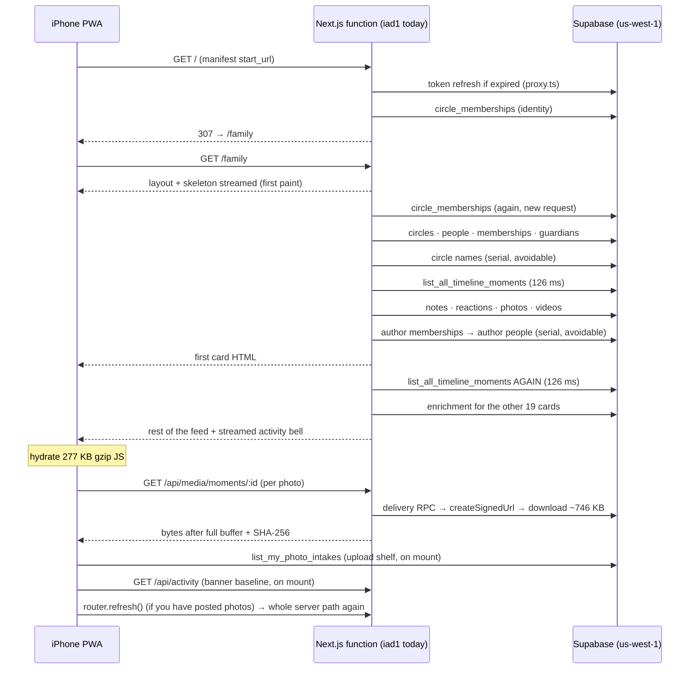

# Our Days — load, upload and flow performance audit

> **DISCOVERY ONLY — DO NOT BUILD YET. Brian picks.**
> Nothing here has been implemented. No pull request was opened. No production
> data or setting was changed. After Brian picks items, each one gets its own
> build brief → coding agent → PR → Preview → phone soak → merge.

|          |                                                                                                                                                                                                                                                                                                                                    |
| -------- | ---------------------------------------------------------------------------------------------------------------------------------------------------------------------------------------------------------------------------------------------------------------------------------------------------------------------------------- |
| Date     | 2026-09-23                                                                                                                                                                                                                                                                                                                         |
| Base     | `main` @ `0034902` (#129)                                                                                                                                                                                                                                                                                                          |
| Brief    | `perf-load-upload-flow-audit.md` (cold open, uploads, everyday flow)                                                                                                                                                                                                                                                               |
| Evidence | Code reading (file:line pointers below), a local production build for bundle sizes, and **read-only** production diagnostics: response headers, Supabase project metadata, performance advisors, `pg_stat_statements` aggregates, counts and media byte sizes. No family content was read. Raw data: [EVIDENCE.md](./EVIDENCE.md). |

## Executive summary

1. **Geography is the biggest cost.** Functions run in Vercel `iad1` (US East) but Supabase is `us-west-1`; every serial database call crosses the continent (~60–70 ms): ~8–10 before the first post paints, ~17 per photo processed. Moving functions to `sfo1` is a setting (P0-1).
2. **One check costs 655 ms (measured):** a `pg_timezone_names` lookup inside photo/video reservation and moment create/edit RPCs (P0-2).
3. **Cold open repeats work:** an extra `/`→`/family` hop, the feed RPC (126 ms mean) runs twice back-to-back, and anyone who has posted photos gets a second full refresh on every cold launch (P0-3, P0-4, P0-10).
4. **Background churn competes with the feed:** the upload-shelf poll is the #1 database consumer (52k calls), activity polls every 30 s, every app switch refetches the whole feed, and #129 restarted video downloads for poster warm-up after every cold launch (P0-4, P0-5, P0-9).
5. **Uploads are strictly serial,** including per-photo server processing (3 downloads, 3 full decodes, a fresh worker sign-in) (P1-1, P1-2).
6. **Taps queue behind slow work:** Next 16 runs Server Actions one at a time, and actions await push fan-out and a full feed re-render before returning (P0-6, P1-5).
7. **Suggested first pick:** P0-1, P0-2, P0-4, P0-5, P0-6 (small, low risk), then P0-3, P0-7, P0-8, P0-9, P0-10.
8. **Brian measures first:** a cold-open stopwatch before/after P0-1, one 6-photo post, and a memory check before P1-9 (§6).

## Contents

1. [Measured facts](#1-measured-facts)
2. [Critical paths](#2-critical-paths)
3. [P0 — clear wins](#3-p0--clear-wins-high-confidence-lowmedium-risk)
4. [P1 — strong wins, more effort or risk](#4-p1--strong-wins-more-effort-or-risk)
5. [Later](#5-later--speculative-or-product-adjacent)
6. [Needs Brian's phone before coding](#6-needs-brians-phone-before-coding)
7. [Side findings (not performance)](#7-side-findings-not-performance)
8. [Pick sheet](#8-pick-sheet)
9. [Notes for build agents](#9-notes-for-build-agents)

Legend: **Effort** S = one small PR, M = a few files or one migration with tests,
L = multi-PR or schema/backfill. **Risk** is the chance of regressing the product
bar (broken chrome, dead media, interrupt cards, stuck chips, notification spam)
or a privacy rule.

## 1. Measured facts

| Fact            | Value                                                                                                        | Source        |
| --------------- | ------------------------------------------------------------------------------------------------------------ | ------------- |
| Function region | `iad1` (`x-vercel-id: pdx1::iad1::…` on `/`, `/sign-in`, `/api/media/*`)                                     | EVIDENCE §1   |
| Database region | Supabase `us-west-1`                                                                                         | EVIDENCE §1   |
| Auth check      | ES256 keys → `getClaims()` verifies locally; network only for token refresh (1 h JWT) and cold-instance JWKS | EVIDENCE §1   |
| Feed RPC        | `list_all_timeline_moments` 126 ms mean (max 2.0 s) for 81 moments total                                     | EVIDENCE §2   |
| Top DB consumer | `list_my_photo_intakes` (upload shelf): 52,199 calls, 36 ms mean, 1,903 s total                              | EVIDENCE §2   |
| Timezone check  | one `pg_timezone_names` lookup = 655 ms; write RPC means 138–281 ms, max ~1.5 s                              | EVIDENCE §2–3 |
| Cleanup worker  | 78 photo cleanup jobs queued, 0 completed since 2026-08-31                                                   | EVIDENCE §4   |
| Media           | feed photo avg 746 KB (max 2.3 MB, 2,560 px); video avg 15.6 MB (max 36 MB)                                  | EVIDENCE §4   |
| Bundle          | `/family` first-load JS 277 KB gzip (944 KB raw); Supabase client ≈ 67 KB gzip; composer/upload ≈ 45 KB gzip | EVIDENCE §6   |
| Scale           | 42 live moments, 63 photos, 13 videos, 3 circles, 12 active memberships                                      | EVIDENCE §4   |

Caveat: `pg_stat_statements` covers ~23 days and includes Preview test traffic,
because Preview shares the production Supabase project
(`config/our-days-environment.ts:688-697`).

### Already good — do not undo

- Shell-first streaming and first-moment paint on `/family` (#69): `src/app/(journal)/family/page.tsx:92-173`, `src/app/(journal)/loading.tsx`.
- Viewport-gated photo loading with a high-priority first photo and carousel neighbor warming (#86/#87): `src/components/private-photo-image.tsx:27-52`, `src/features/timeline/photo-card-pager.tsx:70-97`.
- Proxy skips auth for `/_next/static` (`src/proxy.ts:35-38`); 8 s read deadlines on feed reads.
- 4 MB Bible catalog, `tus-js-client` and MapLibre are lazy-loaded.
- In-place errors inside the persistent shell with one auto-retry for transient failures (`src/features/shell/journal-route-boundary.tsx:46-69`, `journal-interrupted.tsx:8-35`).
- One push per multi-photo batch, including edits (#70): `optimistic-media-upload.ts:234`, `api/photos/process/route.ts:94-97`. Paused/zombie chip cleanup (#67) is intact.

## 2. Critical paths

### 2.1 Cold open (Home Screen icon → first post → first photo)

| Step         | Code                                                                                               | Notes                                                                         |
| ------------ | -------------------------------------------------------------------------------------------------- | ----------------------------------------------------------------------------- |
| Start URL    | `src/app/manifest.ts:9`                                                                            | `/`, not `/family`                                                            |
| `/` page     | `src/app/page.tsx:13-16`                                                                           | full `requireJournalAccess()` just to redirect                                |
| Identity     | `src/lib/auth/journal-access.ts:123-170`                                                           | claims + memberships; `cache()` is per request, so `/` and `/family` both pay |
| Context      | `src/data/journal-context.server.ts:642-713`                                                       | 4 parallel queries, then circle names serially                                |
| Feed         | `src/data/family-home.server.ts:182-262`, `src/data/moments.server.ts:715-831`                     | list RPC twice; enrichment waves                                              |
| Authors      | `src/data/moments.server.ts:137-211`                                                               | up to 4 serial trips for names/accents                                        |
| Photos       | `src/app/api/media/moments/[momentId]/route.ts:82-116`, `src/lib/private-media-delivery.ts:86-115` | 3 serial upstream calls, no streaming, `no-store`                             |
| Photo client | `src/lib/use-private-media-object-url.ts:33-66`, `src/lib/private-media-memory.ts:2-4`             | fetch → blob → object URL; 60 s / 24 / 16 MB tab cache                        |
| Shelf        | `src/features/composer/photo-status-shelf.tsx:611-766, 919-920`                                    | status RPC on mount; may call `router.refresh()`                              |
| Activity     | `src/app/(journal)/family/page.tsx:161-165` + `src/features/shell/activity-banner.tsx:88`          | computed twice per cold open (server slot + client baseline poll)             |

~8–10 serial Supabase calls precede the first card; at ~62 ms each that is
~0.5–0.6 s of waiting before database execution (~170 ms) and any cold start.
Accounting in EVIDENCE §7.

### 2.2 Switching journals (All circles ↔ Just me ↔ a circle ↔ a person ↔ Circles tab)

All links use `prefetch={false}` and a client pending skeleton
(`src/features/shell/journal-pending-route.tsx:93-170`,
`family-title-switcher.tsx:183-209`, `journal-home-link.tsx:22-39`,
`primary-navigation.tsx:131-140`). Every switch is a full server render.

- **All circles** (`/family`): streamed as in §2.1.
- **Just me / any person** (`/people/[id]`): not streamed; waits for context
  **including the activity queries** plus a full 20-card enrichment
  (`src/data/person-journal.server.ts:143-173`).
- **A circle** (`/family?circle=`): `list_timeline_moments` (86–95 ms mean);
  the proxy sets the active-circle cookie (`src/lib/auth/active-circle-middleware.ts`).
- **Circles tab** (`/circles`): context with activity, then the directory
  re-queries people and memberships serially
  (`src/features/family-settings/account-screen.tsx:139-173`,
  `src/data/family-settings.server.ts:152-204`).
- Photos seen more than 60 s earlier are downloaded again (tab cache expiry).

Interrupt history: errors now render in place inside the persistent shell with
one automatic retry for transient failures. What remains is **exposure**: every
full render is another chance to hit an 8 s read deadline and show "These days
couldn't open". Fewer and cheaper renders (P0-1, P0-3, P0-4, P0-9, P1-5) are the
latency-side fix.

### 2.3 Resume / foreground

On every hidden→visible transition, after 1.2 s:
`router.refresh()` (full server render including activity,
`src/features/timeline/timeline-refresh-control.tsx:75-118`,
`timeline-resume-refresh.ts:1`), **and** a `/api/activity` poll
(`activity-banner.tsx:77-90`), **and** `list_my_photo_intakes`
(`photo-status-shelf.tsx:921-937`). There is no minimum time away.

### 2.4 Photo post, multi-photo and edit

Single photo: pick (object URL preview) → Post → optimistic chip → SHA-256 in a
worker → `reserve_photo_moment` (281 ms mean) → `claim_photo_intake_upload` →
TUS straight to Supabase (6 MB chunks; one request for an average 4.4 MB
original) → `acknowledge_photo_intake` → `/api/photos/process` (worker in
`iad1`: ~17 serial calls, 3 downloads, 3 decodes) → status → published
(`src/features/composer/photo-upload.ts:672-1085`,
`src/lib/photo-worker.server.ts:360-630`).

Refreshes during one post: when the upload first gets a moment ID
(`photo-status-shelf.tsx:964-969`), when it publishes (`:993-999`), plus the
composer's `router.replace` on close. Multi-photo adds a refresh per poll cycle
that sees another published intake (`:693-710, 766, 956-962`) — up to ~6 full
feed renders for a 6-photo post.

Multi-photo: files go strictly one after another, each waiting for its server
processing and status read (`optimistic-media-upload.ts:225-272`); only one
upload task runs at a time app-wide (`:183-193, 408-417`).

Edit: `update_family_moment` (273 ms mean) + an inline feed re-render →
`removePhoto` per removed photo, each its own action and re-render → `reorder`
(another) → new files upload sequentially → `router.replace`
(`src/features/composer/moment-composer.tsx:1273-1367`).

### 2.5 Video post and playback

Post: inspect + 720 px poster capture at pick → `reserve_video_moment` (202 ms
mean) → TUS with 2 MB chunks (a 15.6 MB average video ≈ 8 sequential PATCHes;
chosen for flaky networks in #43) → `finalize_video_moment` → poster upload +
`attach_video_moment_poster` (`src/features/composer/video-upload.ts`,
`src/features/video/persist-video-poster.ts:26-83`).

Playback: every Range request runs proxy auth + `get_video_moment_delivery` +
`createSignedUrl` + an upstream fetch from `iad1`
(`src/app/api/media/videos/[momentId]/route.ts:165-237`). Posters go through the
same pattern (`poster/route.ts:66-95`). Warm-up behavior: see P0-5.

### 2.6 Hearts and comments

Heart: optimistic, but the action awaits push fan-out and taps are ignored while
pending (`moment-conversation-control.tsx:321-373`,
`moment-actions.ts:922-968`). Comment: not optimistic — awaits `createNote`
(push inline) then a second action to reload the conversation before closing
(`moment-conversation-control.tsx:393-447`). Opening comments is itself a
Server Action (`moment-actions.ts:722-771`). Next 16 dispatches Server Actions
**one at a time per client**
(`node_modules/next/dist/docs/01-app/02-guides/server-actions.md:26-32`), so all
of these queue behind any in-flight save.

## 3. P0 — clear wins, high confidence, low/medium risk

Ordered by impact ÷ effort.

### P0-1 · Run functions next to the database (`iad1` → `sfo1`)

- **Problem / evidence:** production function region is `iad1`; Supabase is
  `us-west-1` (EVIDENCE §1). No region is pinned in the repo. Serial calls per
  flow: ~8–10 before the first card (§2.1), 3 per photo shown, ~17 per photo
  processed (EVIDENCE §7); photo bytes travel storage → `iad1` → phone.
- **Change:** set the Vercel project's Function Region to `sfo1`
  (Project → Settings → Functions) or add `vercel.json` with
  `{"regions": ["sfo1"]}`. No app code. (`preferredRegion` is deprecated in
  Next 16; use the platform setting.)
- **Expected effect (estimate):** first post on cold open −0.5–0.6 s; each photo
  −0.2–0.5 s; each photo processed −1.5–2.5 s; every refresh, switch, save and
  comment faster. Multiplies the value of every other item.
- **Risk:** Low. Instant rollback. Confirm there is no reason to keep `iad1`.
  If most of the family is on the East Coast, their phone→function hop grows
  (~60 ms per request) but the many serial database calls still dominate.
- **Effort:** S.
- **Success metric:** `x-vercel-id` shows `::sfo1::`; Preview
  `[preview-supabase-timing]` `headersMs` p50 < 15 ms; cold-open stopwatch;
  `[photo-process] started → published` duration in Vercel logs.

### P0-2 · Replace the 655 ms timezone lookup in write RPCs

- **Problem / evidence:** `pg_catalog.pg_timezone_names` is queried to validate
  the posted timezone (`supabase/migrations/20260908021903_keep_just_me_moment_tags.sql:364-367`
  and the latest create/update family moment, video reservation and insight
  definitions). One lookup measured 655 ms on production. Means:
  `reserve_photo_moment` 281 ms (max 1,451), `update_family_moment` 273 ms,
  `reserve_video_moment` 202 ms, `create_family_moment` 138 ms (max 1,173) vs
  `attach_photo_to_moment` 52 ms (EVIDENCE §2–3).
- **Change:** one migration: a `private.valid_time_zones(name text primary key)`
  table seeded from `pg_timezone_names` (identical accepted set), a small
  `private.is_valid_time_zone(text)` helper, and re-created RPCs that use it.
  Keep the existing DB tests.
- **Expected effect:** posting, editing and starting a photo/video upload each
  get −0.1–0.65 s faster; most of the 1–1.5 s spikes should disappear.
- **Risk:** Low (same accepted names; a future tzdata change needs a re-seed).
- **Effort:** S–M (mechanical re-create of ~5 functions).
- **Success metric:** those four RPC means < 30 ms in `pg_stat_statements`;
  edit "Saving…" duration.

### P0-3 · Query the feed once per render; enrich the first card and the rest in parallel

- **Problem / evidence:** `FamilyTimeline` calls `loadFamilyHomeOpeningTimeline`
  (`src/data/family-home.server.ts:182-230`, `enrichLimit: 1`), then the
  streamed remainder calls `loadConnectedTimeline` again
  (`:232-262`, `enrichOffset: 1`), so `list_all_timeline_moments` (126 ms mean)
  runs twice back-to-back (`src/data/moments.server.ts:764-799`) on every cold
  open, pull, resume and post-save refresh. The remainder can only start after
  the first card finishes. This is also open reliability finding #3: a concurrent
  insert can shift the boundary (`docs/operations/RELIABILITY_REVIEW_2026-09-18.md:47-50`).
- **Change:** split `loadConnectedTimeline` into list + enrich, share one list
  result per request (for example React `cache()`), and start the remainder's
  enrichment at the same time as the first card's. Keep the Suspense shape and
  `FeedSaveAcknowledgment` behavior.
- **Expected effect:** the rest of the feed arrives ~1 round trip + 126 ms
  sooner; every refresh does one fewer heavy RPC; no duplicate/missing card at
  the boundary.
- **Risk:** Low–Medium (streaming + acknowledgment; tests exist in
  `family-home.server.test.ts`, `timeline-feed.test.tsx`).
- **Effort:** S–M.
- **Success metric:** one `list_all_timeline_moments` per `/family` render;
  first-card → last-card time.

### P0-4 · Stop the upload shelf forcing a refresh on every cold launch; poll only when there is work

- **Problem / evidence:** the shelf checks status on mount
  (`src/features/composer/photo-status-shelf.tsx:919-920` →
  `list_my_photo_intakes` at `:618`). That RPC returns every intake whose storage
  cleanup is not `completed`
  (`supabase/migrations/20260904234931_multi_photo_moments.sql:453-459`);
  production has 78 cleanup jobs queued and 0 completed, so every photo you have
  ever uploaded in the active circle comes back each time (78 across the family
  today). Each maps to "published" (`:125-134, 215-221`), and
  `firstPublishedMediaRefresh(item.id)` uses `sessionStorage`
  (`optimistic-media-upload.ts:449-462`), which is empty after every PWA cold
  launch — so the first check calls `router.refresh()` (`:693-710, 766`). The
  shelf also checks on every resume and `online` event (`:921-937`). This RPC is
  the top database consumer: 52,199 calls, 1,903 s total (EVIDENCE §2).
- **Change:** (a) treat rows the device is not tracking as a silent baseline —
  refresh only for intakes tied to an optimistic upload or a local resume record;
  (b) check on mount/resume only when there is local evidence of work
  (optimistic uploads, IndexedDB resume records) or once per session; (c) keep
  10 s polling only while work is active.
- **Expected effect:** removes a second full feed render ~1–2 s after every cold
  launch for anyone who has posted photos — exactly when the first photos are
  downloading; most shelf database calls disappear.
- **Risk:** Low (keep the recovery path for real in-flight uploads; tests in
  `photo-status-shelf.test.tsx`, `photo-status-shelf.reload.test.tsx`).
- **Effort:** S.
- **Success metric:** one `/family` render per cold launch (Vercel logs);
  `list_my_photo_intakes` calls per day down >80%.

### P0-5 · Undo the #129 video warm-up regression and viewport-gate posters

- **Problem / evidence:** `src/features/timeline/video-moment-media.tsx:86`
  sets `shouldWarmPoster = !storedPoster || serverPosterLooksLikelyBlank`.
  `storedPoster` lives in tab `sessionStorage`
  (`src/features/video/video-poster-store.ts:25-37`), so after every cold launch
  it is empty and every video or Insight clip within 200 px gets: the visible
  player at `preload="auto"` (`:143-145`), a second hidden
  `<video preload="auto">` warm-up (`src/features/video/warm-video-poster.ts:72-101`),
  and a full-resolution canvas JPEG encode on the main thread
  (`src/components/private-video-player.tsx:92-121`). The poster itself is
  fetched on mount without viewport gating (`video-moment-media.tsx:82-84`).
  #129 changed the trigger from "no poster fetched" to this condition. Videos
  average 15.6 MB, and every Range request pays auth + RPC + signing in `iad1`.
- **Change:** `shouldWarmPoster = !moment.video.poster || serverPosterLooksLikelyBlank`
  (keeps #129's stale-poster regeneration); `preload="metadata"` when a good
  server poster exists; viewport-gate the poster fetch like photos; skip the
  visible player's canvas capture when a good server poster exists.
- **Expected effect:** far less cellular data and proxy work on video days;
  smoother scrolling past videos; nearby photos load sooner.
- **Risk:** Low. Watch Insight clip posters (the case #129 fixed).
- **Effort:** S.
- **Success metric:** `/api/media/videos/*` requests and bytes per cold open;
  no increase in blank posters.

### P0-6 · Deliver push notifications after the response (`after()`)

- **Problem / evidence:** family post (`src/features/moments/moment-actions.ts:299-301`),
  note (`:813`), reaction (`:960-962`) and photo publication
  (`src/features/family-settings/web-push-actions.ts:112`) all
  `await deliverActivityWebPush` (`src/lib/web-push/deliver-activity.ts:57-127`:
  `list_web_push_deliveries` 28 ms mean / 1.45 s max, one send per device,
  stale-endpoint deletes) before returning. Because Server Actions run one at a
  time per client, the next heart, comment open or post waits too.
- **Change:** wrap the fan-out in `after()` from `next/server` (supported in
  Server Functions — `node_modules/next/dist/docs/01-app/03-api-reference/04-functions/after.md`).
  Keep the logs.
- **Expected effect:** hearts, comments and posts acknowledge faster by the push
  time (typically 0.1–0.5 s, sometimes >1 s); follow-up taps stop waiting.
- **Risk:** Low (push stays best-effort; delivery semantics unchanged).
- **Effort:** S.
- **Success metric:** p50/p95 durations of the reaction/note/create actions in
  Vercel logs; heart tap → acknowledged.

### P0-7 · Remove avoidable serial hops in bootstrap and card enrichment

- **Problem / evidence:** (a) circle names are fetched after the first batch
  though they do not depend on it (`src/data/journal-context.server.ts:696-713`)
  — every journal page; (b) conversation authors take notes/reactions →
  memberships → people → maybe `visible_moment_authors`, up to 4 serial trips
  (`src/data/moments.server.ts:137-211`), although context already holds every
  roster member's name (`memberNames`, `journal-context.server.ts:752-757, 897`);
  (c) video metadata and posters are queried serially (`moments.server.ts:567-589`).
- **Change:** (a) move the circles query into the first `Promise.all`;
  (b) resolve authors from context (add an accent per membership) and call
  `visible_moment_authors` only for unknown authors; (c) query videos and posters
  in parallel.
- **Expected effect:** first card −2 to −3 serial round trips (~130–200 ms
  today, ~10 ms after P0-1); every page and refresh benefits.
- **Risk:** Low.
- **Effort:** S.
- **Success metric:** serial Supabase calls before the first card (Preview
  timing logs) from ~8 to ~5.

### P0-8 · Keep activity off the critical path everywhere, and bound its queries

- **Problem / evidence:** only `/family` loads context with
  `includeActivity: false` (`src/data/family-home.server.ts:152-154`) and streams
  the bell (`src/app/(journal)/family/page.tsx:161-165`). Just me / person
  journals (`src/data/person-journal.server.ts:153`), Circles/Settings
  (`src/features/family-settings/account-screen.tsx:139`), Memories
  (`src/data/memories-home.server.ts:173, 193`) and Trash
  (`src/data/trash.server.ts:77`) wait for `loadOptionalJournalActivity`
  (`journal-context.server.ts:378-548`): three queries with no limit (all your
  moments ever and all your notes ever, `:386-416`), then up to two more serial
  trips, feeding ever-longer `.in(...)` lists. The same loader backs
  `/api/activity` (`src/app/api/activity/route.ts:16-20`), polled every 30 s,
  on every resume, on bell open, and once at cold open on top of the server slot.
- **Change:** use `includeActivity: false` on those pages and stream the bell
  through the existing `activity` slot as `/family` does; add a limit or time
  window (the bell shows 20 items); let the banner seed its baseline from the
  server-rendered items instead of an immediate poll.
- **Expected effect:** Just me and Circles paint sooner (−2–3 serial trips plus
  unbounded query time); activity cost stops growing with history; avoids a
  future silently empty bell when the `.in(...)` URLs get too long.
- **Risk:** Low (bell content unchanged; `notification-center.test.tsx`).
- **Effort:** S–M.
- **Success metric:** time to first post on `/people/[me]`; Circles paint time;
  `/api/activity` p50.

### P0-9 · Refresh on resume only after a real absence; coalesce resume work

- **Problem / evidence:** §2.3 — any return after 1.2 s triggers a full
  `router.refresh()`, an activity poll and a shelf status RPC at once.
- **Change:** refresh only if the app was hidden for ≥ ~60 s or the last refresh
  is older than ~60 s (tunable); skip the banner's resume poll when a refresh is
  starting; shelf check on resume only with local in-flight work. Pull-to-refresh
  and #57's intent stay.
- **Expected effect:** glancing at a text and coming back no longer re-renders
  the whole feed or shows the refresh state; less data; fewer chances to land on
  "These days couldn't open".
- **Risk:** Low (content can be up to ~60 s old after a quick switch).
- **Effort:** S.
- **Success metric:** `/family` renders per hour of use; resume → interactive.

### P0-10 · Skip the `/` → `/family` hop for signed-in launches

- **Problem / evidence:** the PWA start URL is `/` (`src/app/manifest.ts:9`);
  `src/app/page.tsx:13-16` runs `requireJournalAccess()` (claims + memberships
  query) only to redirect to `/family`, which repeats it in a new request.
- **Change:** in `src/app/page.tsx` (or `src/proxy.ts` before `getClaims`),
  redirect to `/family` when a Supabase session cookie is present, without a
  database call; anonymous visitors still get the entry page. Also set
  `start_url` to `/family` for new installs — installed iPhones usually keep the
  start URL they were added with, which is why `/` itself must be cheap.
- **Expected effect:** skeleton paints one server round trip + one DB query
  sooner (~0.15–0.3 s today).
- **Risk:** Low (signed-out users with a stale cookie take one extra hop to
  sign-in).
- **Effort:** S.
- **Success metric:** tap → skeleton time.

## 4. P1 — strong wins, more effort or risk

### P1-1 · Pipeline multi-photo uploads

- **Problem / evidence:** files upload strictly in sequence, each waiting for
  reserve/attach → claim → TUS → acknowledge → `/api/photos/process` → status
  before the next starts (`optimistic-media-upload.ts:225-272`,
  `photo-upload.ts:680-1043`). Constraints: album order is assigned at attach
  (`multi_photo_moments.sql:631-642`), 6 photos max (`:626-629`), at most 3 open
  intakes per account and 10 per circle
  (`supabase/migrations/20260901181748_stop_cleanup_backlog_blocking_uploads.sql:46-67`).
- **Change:** keep attaches sequential (order), hash file N+1 while N uploads,
  request processing for N without blocking N+1, cap concurrency at 2, await all
  at the end; retry per file rather than by index.
- **Expected effect:** a 6-photo post finishes roughly 1.5–2× sooner (server
  processing overlaps uploads).
- **Risk:** Medium (quota, ordering, resume/retry, stuck-chip regressions).
- **Effort:** M.
- **Success metric:** Post tap → album fully published; upload bytes/sec; zero
  quota errors.

### P1-2 · Lighter photo worker per photo

- **Problem / evidence:** each photo signs the worker in with a password and out
  again (`src/lib/photo-worker.server.ts:79-96, 617-630`), downloads the original
  three times and fully decodes it three times (`:360-615`), ~17 serial calls in
  total, plus `getUser` and two status reads in the route
  (`src/app/api/photos/process/route.ts:85-91, 154-157`). Auth sign-ins are rate
  limited per IP (30 per 5 min in local config, `supabase/config.toml:208`;
  verify hosted) — a busy upload session could trip it and leave "processing"
  chips that re-trigger every 10 s.
- **Change:** reuse the worker session on a warm instance (short TTL); build the
  display image from the already-verified spool in the same invocation (keep the
  write + read-back verification); process a multi-photo batch per invocation.
- **Expected effect:** −1–2 s per photo (more before P0-1); fewer stuck
  "processing" states.
- **Risk:** Medium — validator identity and lease rules are threat-model
  decisions (`docs/privacy/THREAT_MODEL.md:51`); needs review.
- **Effort:** M.
- **Success metric:** `[photo-process]` duration p50/p95; 503 count from
  `/api/photos/process`.

### P1-3 · Make feed RPCs cost per page, not per history

- **Problem / evidence:** 126 ms mean for `list_all_timeline_moments` and
  86–95 ms for `list_timeline_moments` with only 81 moments stored; 21 ms for the
  `moment_photos` enrichment select. The `moments` policy calls
  `can_read_live_moment(id)` per row
  (`supabase/migrations/20260907204138_moment_circles.sql:255-260`), nested again
  for photos (`:264-277`); the sort is not index-backed
  (`list_all_timeline_moments.sql:133-177`).
- **Change:** security-definer list RPCs with one set-based visibility predicate
  from the viewer's active memberships, an index matching the order/cursor, and
  the same privacy rules proven by DB tests; revisit the `moment_photos` policy
  and the feed-related foreign-key index advisor notes.
- **Expected effect:** −100 ms per feed call today; flat cost as years of
  moments accumulate.
- **Risk:** Medium–High (privacy boundary; security review + adversarial DB
  tests).
- **Effort:** M–L.
- **Success metric:** mean < 20 ms; `EXPLAIN ANALYZE` as `authenticated` on a
  local database seeded with ~5,000 moments.

### P1-4 · Take the composer and Supabase client out of first-load JavaScript

- **Problem / evidence:** `/family` ships 277 KB gzip. The Supabase client
  (≈ 67 KB gzip, including Realtime) is needed at mount only because the shelf
  polls; the composer, location/date/Bible fields and upload code (≈ 45 KB gzip)
  load through `ComposerSessionProvider` in the persistent chrome
  (`src/features/shell/journal-chrome.tsx:236-240`) before anyone taps Add
  (EVIDENCE §6).
- **Change:** dynamic-import the composer sheet on first Add/Edit with idle
  prefetch; give the shelf its initial state from the server (or a tiny status
  route) and load the Supabase client only when uploading.
- **Expected effect:** ~100 KB gzip (~35%) less JavaScript to parse on cold open
  and after every deploy → earlier hydration → photos start sooner (they wait for
  hydration).
- **Risk:** Low–Medium (Add must still open instantly → prefetch).
- **Effort:** M.
- **Success metric:** first-load JS for `/family`; hydration time on iPhone
  (Safari Web Inspector).

### P1-5 · Keep reads out of the action queue; one render per mutation

- **Problem / evidence:** opening comments is a Server Action
  (`moment-actions.ts:722-771`), so it queues behind any save. Mutations call
  `refreshMomentSurfaces` (nine `revalidatePath` calls, `:176-186`), which already
  re-renders the current page inside the action response
  (`node_modules/next/dist/docs/01-app/02-guides/server-actions.md:34-47`); the
  composer then calls `router.refresh()` again
  (`moment-composer.tsx:1375-1376, 1527`). Photo edits run one action per removed
  photo plus one for reorder, each re-rendering the feed (`:1310-1329`).
- **Change:** serve the conversation read from a GET route handler; drop client
  refreshes where the action already returned fresh UI; batch edit photo changes
  into one action; narrow the revalidation list.
- **Expected effect:** comments open immediately even during a save; an edit
  costs one feed render instead of two to five; posts publish sooner.
- **Risk:** Medium (`FeedSaveAcknowledgment` depends on the refreshed feed; keep
  tests green).
- **Effort:** M.
- **Success metric:** `/family` renders per post/edit; edit Save → sheet closed.

### P1-6 · Optimistic comment send

- **Problem / evidence:** `moment-conversation-control.tsx:393-447` waits for
  `createNote` and a conversation reload before closing the panel. Hearts are
  already optimistic (`:321-358`).
- **Change:** append the note immediately and close; reconcile in the
  background; on failure restore the draft with an error.
- **Expected effect:** comments feel instant.
- **Risk:** Low–Medium.
- **Effort:** S–M.
- **Success metric:** Send → note visible.

### P1-7 · Cheaper private photo delivery per image

- **Problem / evidence:** delivery RPC → `createSignedUrl` → download → buffer
  the whole file → SHA-256 → respond (`src/app/api/media/moments/[momentId]/route.ts:82-116`,
  `src/lib/private-media-delivery.ts:86-115`); posters the same
  (`poster/route.ts:66-95`).
- **Change:** use an authenticated Storage `download()` (one request, same RLS)
  instead of sign + fetch; optionally stream while hashing and abort on mismatch
  (a security decision).
- **Expected effect:** −1 round trip per photo and poster; with streaming, first
  bytes reach the phone earlier.
- **Risk:** Low for `download()`; streaming before the hash completes needs
  sign-off.
- **Effort:** S (download) / M (streaming).
- **Success metric:** `/api/media/moments` time to first byte p50.

### P1-8 · One bootstrap query per page

- **Problem / evidence:** identity memberships (`journal-access.ts:101-112`) →
  context batch → circle names (`journal-context.server.ts:642-713`) are three
  serial trips on every page render, refresh and switch.
- **Change:** a single security-definer `get_journal_bootstrap()` returning
  memberships, circles, people, memberships and guardians, with DB tests.
- **Expected effect:** −2 serial trips on every render.
- **Risk:** Medium (authorization logic in SQL).
- **Effort:** M.
- **Success metric:** one serial call before context is ready.

### P1-9 · Keep recently seen photos for the session (memory only)

- **Problem / evidence:** the in-memory photo cache keeps 24 images for 60 s
  within 16 MB (`src/lib/private-media-memory.ts:2-4`); photos are fetched
  `no-store` (`use-private-media-object-url.ts:33-41`). Switching All circles ↔
  Just me ↔ a circle after a minute re-downloads each photo (~746 KB average)
  through the proxy.
- **Change:** e.g., 10 min / 60 images / ~48 MB, still memory-only and cleared
  on sign-out (consistent with `docs/architecture/ACCEPTANCE_CRITERIA.md:57-58`).
- **Expected effect:** photos appear instantly when switching back and forth.
- **Risk:** Medium — iOS may evict a memory-heavy PWA, causing more cold
  launches. **Needs Brian's phone soak.**
- **Effort:** S.
- **Success metric:** `/api/media/moments` requests per session; no increase in
  relaunches.

## 5. Later — speculative or product-adjacent

| ID  | Idea                                                                                                                                                                                    | Why later                                                                                                          |
| --- | --------------------------------------------------------------------------------------------------------------------------------------------------------------------------------------- | ------------------------------------------------------------------------------------------------------------------ |
| L-1 | Cursor-based "Show earlier days" that appends instead of re-rendering pages 1..N (`moments.server.ts:774-799`, `timeline-feed.tsx:213-224`; `/family` makes 2N list calls at page N)    | Low urgency at 42 live moments (≈3 pages). M.                                                                      |
| L-2 | `experimental.staleTimes.dynamic` ≈ 30 s for instant Journal ↔ Circles back-and-forth (`node_modules/next/dist/docs/01-app/03-api-reference/05-config/01-next-config-js/staleTimes.md`) | Freshness trade-off; experimental flag. S, product call.                                                           |
| L-3 | A smaller feed image (e.g., 1,440 px) while keeping 2,560 px for fullscreen                                                                                                             | ~45–55% fewer bytes per feed photo; needs a new derivative profile and backfill. L.                                |
| L-4 | Static edge shell via Cache Components / PPR                                                                                                                                            | Blocked by the per-request nonce CSP (`src/proxy.ts:11-24`, ADR-014); needs hash-based CSP and security review. L. |
| L-5 | Browser HTTP caching of media (immutable URLs, short private max-age, Clear-Site-Data on sign-out)                                                                                      | Conflicts with `ACCEPTANCE_CRITERIA.md:57-58` and threat model items 9 and 23; ADR change.                         |
| L-6 | Upload a display-size copy first, the original later                                                                                                                                    | Conflicts with the byte-identical original contract (`ACCEPTANCE_CRITERIA.md:40`); product decision.               |
| L-7 | Adaptive video TUS chunk size (2 MB today, chosen in #43)                                                                                                                               | Measure stall rate vs. request overhead first.                                                                     |
| L-8 | Vercel cold starts / Fluid compute settings                                                                                                                                             | Not visible from the repo; check the dashboard.                                                                    |
| L-9 | One RPC returning feed conversations with author names                                                                                                                                  | Only if roster-external authors turn out to be common after P0-7.                                                  |

## 6. Needs Brian's phone before coding

1. **Cold-open stopwatch**, three runs each on Wi-Fi and cellular: tap → skeleton,
   → first post text, → first photo sharp. Before and after P0-1 (Safari Web
   Inspector timeline if convenient).
2. **One 6-photo post**: Post tap → all six visible, before and after P1-1
   (and P0-1).
3. **Comment and heart feel**: Send → note visible; rapid hearts on two cards,
   before and after P0-6 / P1-6.
4. **Video day**: open with two or three videos near the top; note stutter and
   delay before and after P0-5.
5. **Memory soak before P1-9**: switch journals repeatedly for a few minutes;
   does the app relaunch more often?
6. **Where the family is** (roughly West vs. East) — changes how much P0-1 saves;
   it is positive either way.

Agent-side, no code needed: pull one cold open's `[preview-supabase-timing]`
lines from a Preview (per-call `headersMs`), `[photo-process]` durations, and a
`pg_stat_statements` snapshot before and after each picked item. After P0-4,
confirm in Vercel logs that a cold launch produces one `/family` render, not two.

## 7. Side findings (not performance)

- **Photo cleanup never completes in production**: 78 cleanup jobs queued, 0
  completed since 2026-08-31, so an intake copy of every uploaded photo appears to
  remain in storage (threat model item 24; storage cost). It also inflates the
  shelf query (P0-4). Flag for an ops check of the cleanup worker.
- **Preview shares the production database** (`config/our-days-environment.ts:688-697`):
  automated Preview tests add load to production and mix into these statistics.
- **Doc drift**: ADR-033 says conversations load only after a moment is opened;
  the feed now batch-loads notes and reactions (`src/data/moments.server.ts:817-831`).

## 8. Pick sheet

- [ ] P0-1 Functions to `sfo1` — S, low risk
- [ ] P0-2 Timezone check without `pg_timezone_names` — S–M, low risk
- [ ] P0-3 One feed query per render — S–M, low–medium risk
- [ ] P0-4 Upload shelf: no cold-launch refresh, poll only with work — S, low risk
- [ ] P0-5 Video warm-up fix + lazy posters — S, low risk
- [ ] P0-6 Push via `after()` — S, low risk
- [ ] P0-7 Remove serial hops (circle names, authors, video meta) — S, low risk
- [ ] P0-8 Activity off the critical path + bounded — S–M, low risk
- [ ] P0-9 Resume refresh after real absence — S, low risk
- [ ] P0-10 Cheap `/` for signed-in launches — S, low risk
- [ ] P1-1 Pipelined multi-photo upload — M, medium risk
- [ ] P1-2 Lighter photo worker — M, medium risk (threat-model review)
- [ ] P1-3 Feed RPCs per page, not per history — M–L, medium–high risk
- [ ] P1-4 Composer + Supabase client out of first load — M, low–medium risk
- [ ] P1-5 Reads out of the action queue; one render per mutation — M, medium risk
- [ ] P1-6 Optimistic comment send — S–M, low–medium risk
- [ ] P1-7 Cheaper photo delivery — S/M, low risk (streaming needs sign-off)
- [ ] P1-8 One bootstrap query — M, medium risk
- [ ] P1-9 Session photo cache sizing — S, medium risk (phone soak)

## 9. Notes for build agents

- Read `node_modules/next/dist/docs/` before coding (AGENTS.md). Relevant here:
  `after.md`, `02-guides/server-actions.md` (sequential dispatch; one response
  carries data and UI), `revalidatePath.md`, `staleTimes.md`,
  `preferredRegion.md` (deprecated — use the platform region), `proxy.md`
  (Node runtime).
- Locked IA stays: Journal header Just me | All circles; audience chips are
  decoration only; bottom Journal · Add · Circles; Settings top-left; Insight
  chrome from #129; native video fullscreen.
- Privacy rules stay: no persistent media cache, per-request membership checks,
  nonce CSP, `private, no-store` on authenticated routes.
- Measure with care: Preview uses the production database.
